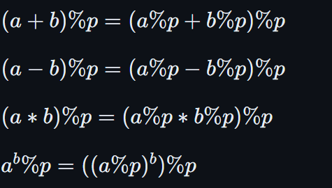

# Quick power
Calculate the value: $a^b\space mod \space p$, where $1\le a,b,p \le  10^9$.

$b$ can be expressed in binary form as $c_{k-1}2^{k-1} + c_{k-2}2^{k-2} + \ldots + c_02^0$, where $c_i=1||0$.

So: $a^b=a^{c_{k-1}2^{k-1}}\cdot a^{c_{k-2}2^{k-2}}\cdot...\cdot a^{c_0a^0}$

```c++
typedef long long  LL;
long long quick_pow(LL a,LL b,LL p)
{
    LL res=1;
    while(b)
    {
        
        if(b&1) res = res *a %p;
        
        b>>=1;
        
        a=a*a%p;
    }
    return res;
}
```

**Some principles of modulo:**



