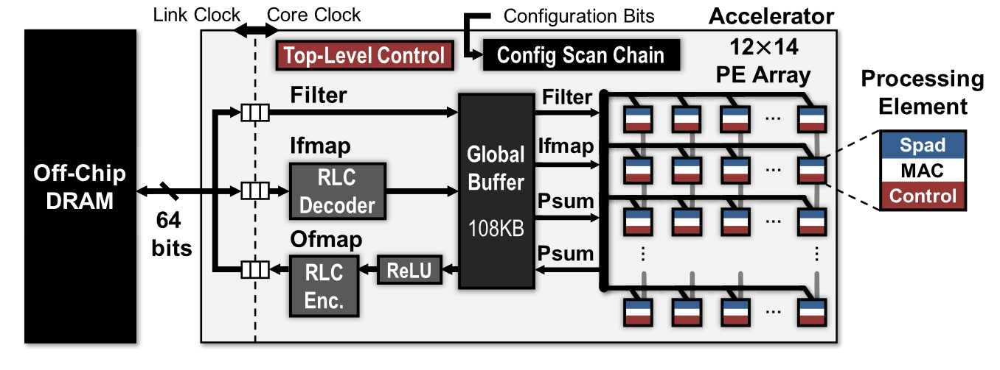
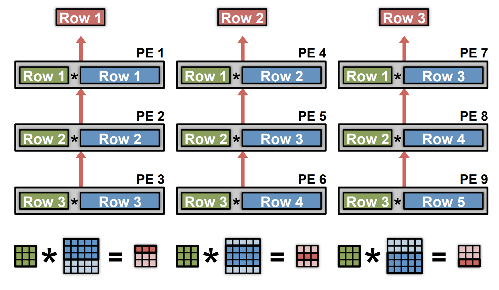
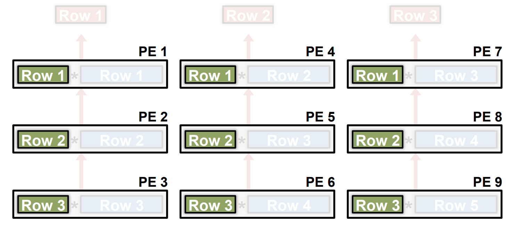
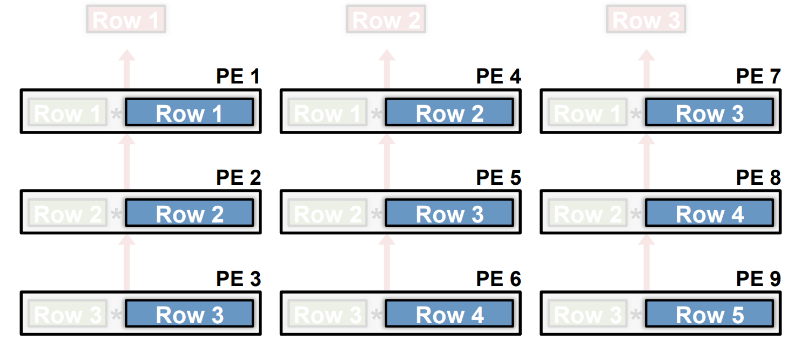
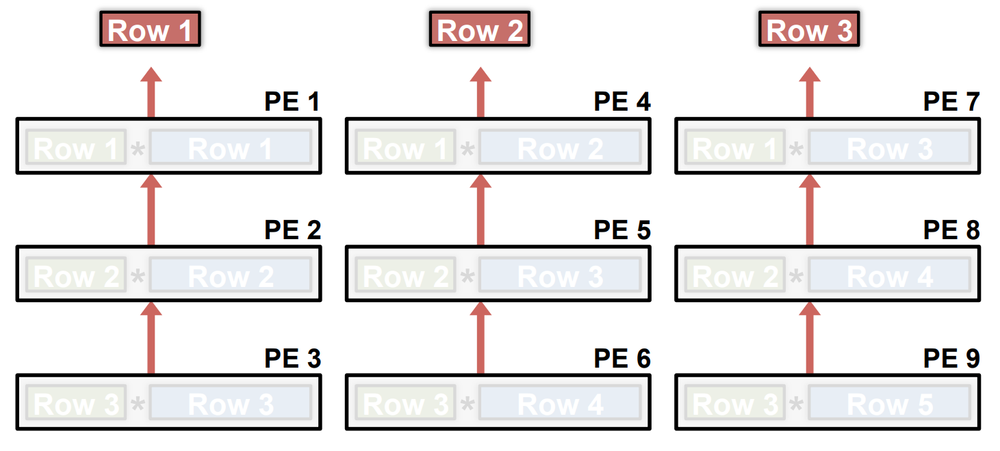
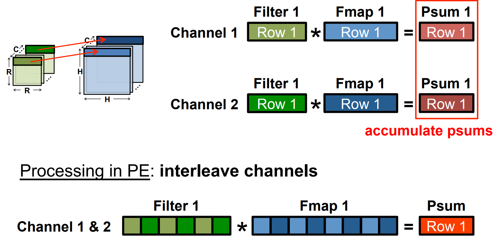
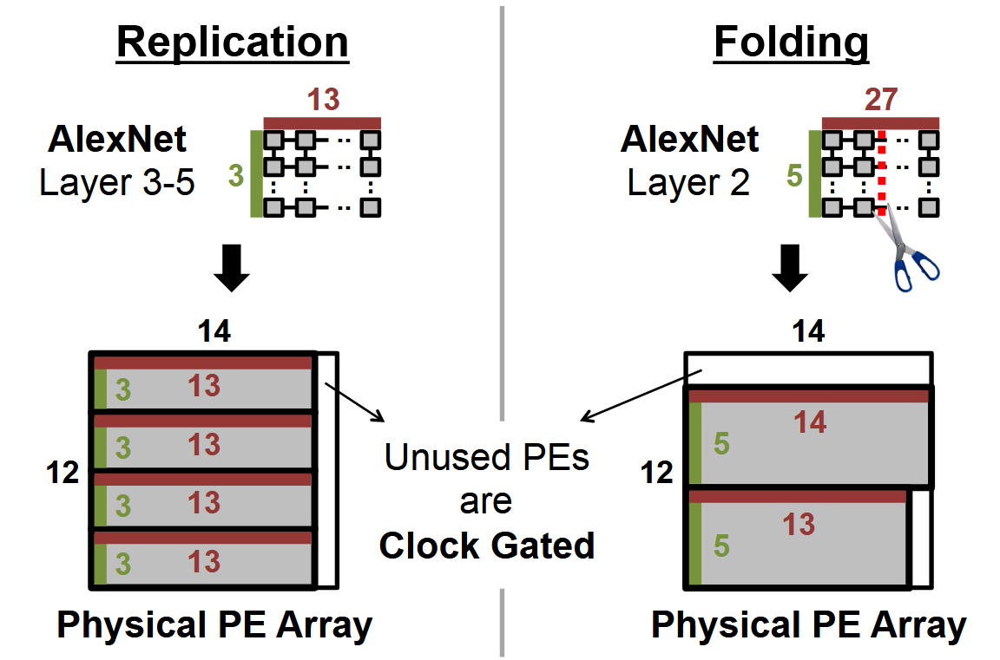

# Eyeriss : An Energy-Efficient Reconfigurable Accelerator for Deep Convolutional Neural Networks

Related abbreviations：
- PEs: processing elements
- GLB: global buffer
- NoC: network-on-chip
- RLC: Run-length compression 
- ifmaps: input feature maps
- ofmaps: output feature maps
- psums: patial sums


Eyeriss system architecture: 

- Two clock domains:
  - Core clock domain :for processing.
  - Link clock domain :for communication with the off-chip DRAM.
  - Two domains run independently and communicate through an asynchronous FIFO interface.

- Four levels of memory hierarchy: in decreasing energy per access: DRAM, GLB, inter-PE communication, and spads.
- To transfer data for computation, each PE can communicate with:
  -  Its neighbor PEs
  -  The GLB through an NoC
  -  Spads: a memory space that is local to the PE

1-D Convolution In a PE: filter row is fixed


2-D Convolution in PEs:



- Filter rows are reused across PEs horizontally.
  
- Fmap rows are reused across PEs diagnally.
  
- Partial sums accumulated across PEs veritally.
  

Dimensions Beyond 2-D Convolution:
- Multiple Fmaps:
  
- Multiple Filters:
  
- Multipel channels: Psum=Psum1+Psum2
  
- Full picture: Map rows from multiple fmaps, filters and channels to same PE to exploit other forms of reuse and local accumulation
  


Hardware Architecture: input filter and fmap, output the result fmap


Data Delivery with NoC:


Accommodate different shapes with fixed PE array:




PE: 
```verilog
`timescale 1ns / 1ps

module PE_new#(parameter DATA_BITWIDTH = 16,
			        parameter ADDR_BITWIDTH = 9,
               parameter W_READ_ADDR = 0,     //Weights READ address
			 parameter A_READ_ADDR = 100,   //Activations READ address
			 
			 parameter W_LOAD_ADDR = 0,     //Weights LOAD address
			 parameter A_LOAD_ADDR = 100,   //Activations LOAD address
			 
			 parameter PSUM_ADDR = 500,
			 
			 parameter kernel_size = 3,
			 parameter act_size = 5 

              )
      (
        input reset,clk,
        input [DATA_BITWIDTH-1:0] act_in,
        input [DATE_BITWIDTH-1:0] filt_in,
        input load_en_wght,load_en_act,
        input start,
        output [DATA_BITWIDTH-1:0] pe_out,
        output reg load_done,
        output reg compute_done
      )

  reg [2:0] state;
	localparam IDLE=3'b000;
	localparam READ_W=3'b001;
	localparam READ_A=3'b010;
	localparam COMPUTE=3'b011;
	localparam WRITE=3'b100;
	localparam LOAD_W=3'b101;
	localparam LOAD_A=3'b110;

  reg read_en, write_en;
	reg [ADDR_BITWIDTH-1:0] w_addr, r_addr;
	reg [DATA_BITWIDTH-1:0]  w_data;
	wire [DATA_BITWIDTH-1:0] r_data;

  Spad #(
    .DATA_BITWIDTH(DATA_BITWIDTH),
		.ADDR_BITWIDTH(ADDR_BITWIDTH)
  )
  spad_pe0(.clk(clk),.reset(reset),.read_req(read_en),
           .write_en(write_en),.r_addr(r_addr),..w_addr(w_addr),
		      .w_data(w_data),
		      .r_data(r_data));

	wire [DATA_BITWIDTH-1:0] psum_reg;
	wire [DATA_BITWIDTH-1:0] sum_in;
	reg sum_in_mux_sel;
	
	reg [DATA_BITWIDTH-1:0] act_in_reg;
	reg [DATA_BITWIDTH-1:0] filt_in_reg;
	
	reg mac_en;
	//MAC Instantiation
	MAC  #( 
		.IN_BITWIDTH(DATA_BITWIDTH),
		.OUT_BITWIDTH(DATA_BITWIDTH) )
	mac_0
				( .a_in(act_in_reg),
				  .w_in(filt_in_reg),
				  .sum_in(sum_in),
				  .en(mac_en),
				  .clk(clk),
				  .out(psum_reg)
				);
			
	mux2 #( .WIDTH(DATA_BITWIDTH) )
	mux2_0 (
			.a_in(psum_reg), 
			.b_in({(DATA_BITWIDTH){1'b0}}), 
			.sel(sum_in_mux_sel), 
			.out(sum_in) 
			);
	
	
	reg [7:0] filt_count;
	reg [2:0] iter;
	
	always @(posedge clk) begin
		if(reset) begin
			filt_count<=0;
		end
	end

endmodule


module SPad #( parameter DATA_BITWIDTH = 16,
			 parameter ADDR_BITWIDTH = 9 )
		   ( input clk,
			 input reset,
			 input read_req,
			 input write_en,
			 input [ADDR_BITWIDTH-1 : 0] r_addr,
			 input [ADDR_BITWIDTH-1 : 0] w_addr,
			 input [DATA_BITWIDTH-1 : 0] w_data,
			 output  [DATA_BITWIDTH-1 : 0] r_data
    );
	
	reg [DATA_BITWIDTH-1 : 0] mem [0 : (1 << ADDR_BITWIDTH) - 1]; 
		// default - 512(2^9) 16-bit memory. Total size = 1kB 
	reg [DATA_BITWIDTH-1 : 0] data;
	
	always@(posedge clk)
		begin : READ
			if(reset)
				data <= 0;
			else
			begin
				if(read_req) begin
					data <= mem[r_addr];
//					$display("Read Address to SPad:%d",r_addr);
				end else begin
					data <= 10101;
				end
			end
		end
	
	assign r_data = data;
	
	always@(posedge clk)
		begin : WRITE		 
			if(write_en && !reset) begin
				mem[w_addr] <= w_data;
			end
		end
	
endmodule


module MAC #(parameter IN_BITWIDTH=16,
            parameter OUT_BITWIDTH=32)
            (
              input clk,
              input en,
              input [IN_BITWIDTH-1:0] w_in,
              input [IN_BITWIDTH-1:0] a_in,
              input  [IN_BITWIDTH-1:0] sum_in,
              output reg[OUT_BITWIDTH-1:0] sum_out
            )

            always @(posedge clk) begin
              if(en) begin
                sum_out<=a_in*w_in+sum_in;
              end
            end

endmodule

module mux2 #( parameter WIDTH = 16)
	(
    input [WIDTH-1:0] a_in,
    input [WIDTH-1:0] b_in,
    input sel,
    output [WIDTH-1:0] out
    );
	
	assign out = sel ? a_in : b_in;
	
endmodule

```