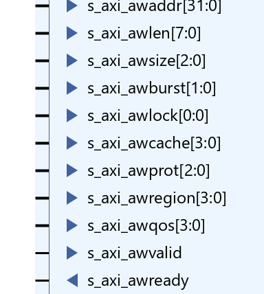

# AXI
## Signal Description
Vivado IP AXI-full

1. Write address channel:  `m/s _ axi _ aw... `
   
   
2. Write data channel: `m/s _ axi _ w... ` 
   
   
3. Write response channel: `m/s _ axi _ b...` 
   
   
4. Read address channel: `m/s _ axi _ ar...` 
   
   
5. Read data channel : `m/s _ axi _ r...` 
   
   

AXI-Stream

AXI4-Stream contains three types of data stream:
- data type: general data
- position type: represents the position of the data as a placeholder.
- null type: null

Some signals of AXI4-Stream:

- tvalid
- tready
- tdata[8*n-1:0]: n is the number of bytes
- tstrb[n-1:0], tkeep[n-1:0]: represent the type of the data
   | TKEEP | TSTRB | type     |
   |-------|-------|--------------------|
   |   1   |   1   | data type |
   |   0   |   0   | null type |
   |   1   |   0   | position type |
   |  0 |  1   | reserved |
  
- tlast: indicates the boundary of a packet
- tid
- tdest
- tuser

准备地址，发送地址，接受地址，准备数据