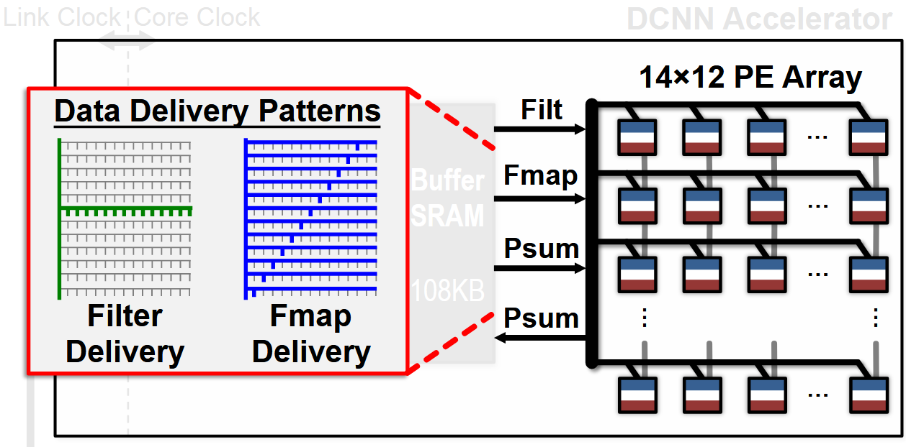

# Eyeriss : An Energy-Efficient Reconfigurable Accelerator for Deep Convolutional Neural Networks

## Related abbreviations
- PEs: processing elements
- GLB: global buffer
- NoC: network-on-chip
- RLC: Run-length compression 
- ifmaps: input feature maps
- ofmaps: output feature maps
- psums: patial sums

## Eyeriss system architecture

- Two clock domains:
  - Core clock domain :for processing.
  - Link clock domain :for communication with the off-chip DRAM.
  - Two domains run independently and communicate through an asynchronous FIFO interface.

- Four levels of memory hierarchy: in decreasing energy per access: DRAM, GLB, inter-PE communication, and spads.
- To transfer data for computation, each PE can communicate with:
  -  Its neighbor PEs
  -  The GLB through an NoC
  -  Spads: a memory space that is local to the PE

## PE architecture
1-D Convolution In a PE: filter row is fixed

2-D Convolution in PEs:

- Filter rows are reused across PEs horizontally.
  
- Fmap rows are reused across PEs diagnally.
  
- Partial sums accumulated across PEs veritally.
  

## Dimensions Beyond 2-D Convolution:
- Multiple Fmaps:
  
- Multiple Filters:
  
- Multipel channels: Psum=Psum1+Psum2
  
- Full picture: Map rows from multiple fmaps, filters and channels to same PE to exploit other forms of reuse and local accumulation
  

Hardware Architecture: input filter and fmap, output the result fmap

Data Delivery with NoC:

Accommodate different shapes with fixed PE array:

