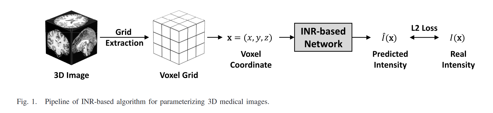
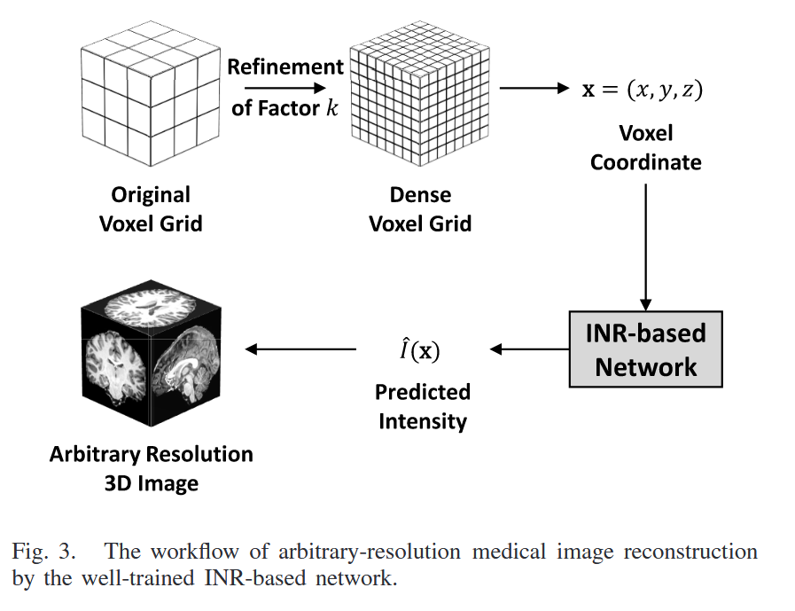
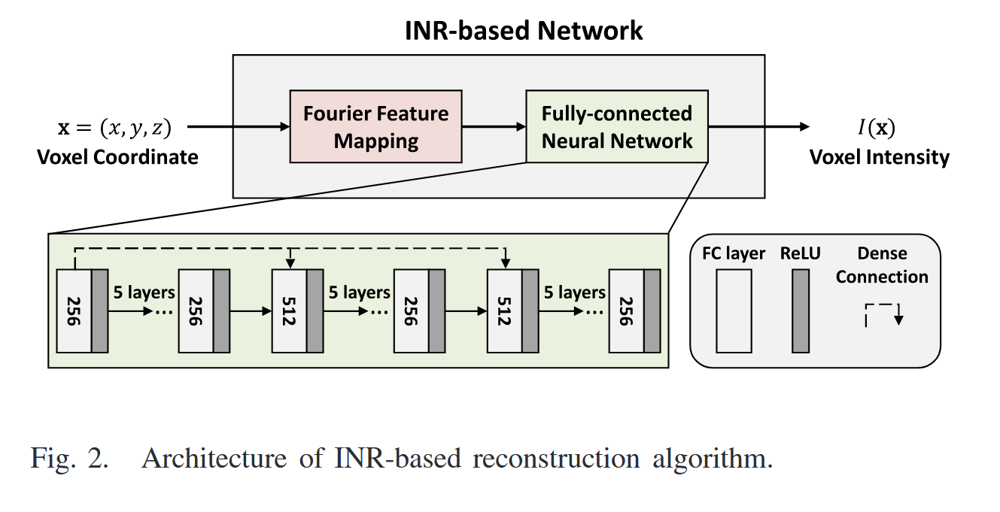
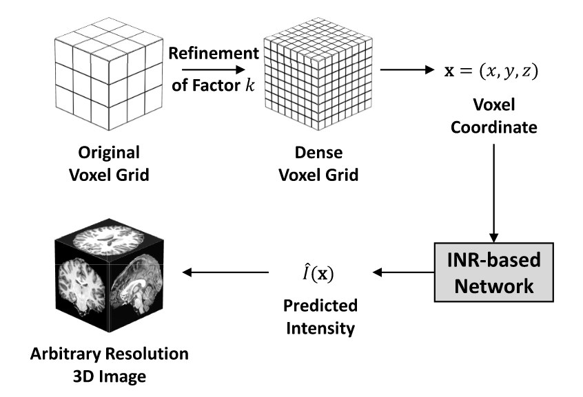
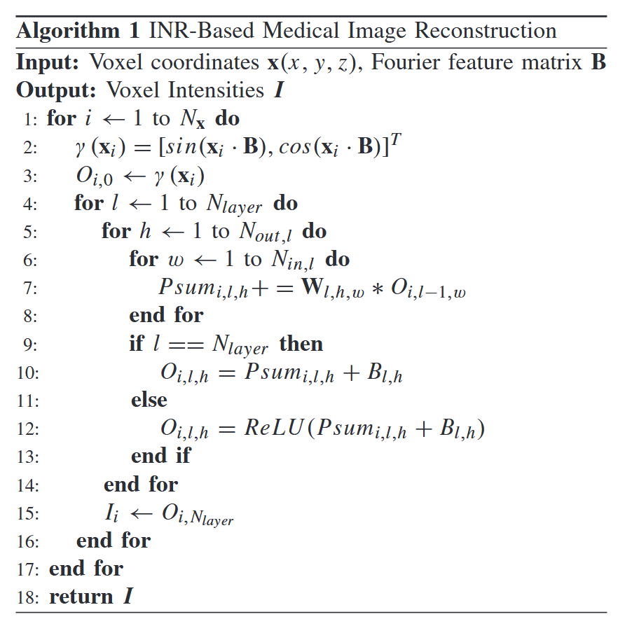

# An Energy-Efficient Accelerator for Medical Image  Reconstruction From Implicit Neural Representation

## Introduction
### Background and Problems

### Limitation of Existing Methods
The existing common medical image compression standard , is based on discrete voxel representation due to the digital computation and storage system, which results in a severe trade-off problem between data accuracy and storage resources

Heavy burden of data dimension also requires more powerful hardware for 3D image display, storage and transmission

Advanced image compression and reconstruction techniques that decouple image size and data fidelity

With a high compression rate, the transmission is possibly to be completed wireless and received using portable terminals like tablets or even cellphones

###  New Methods
Implicit neural representation(INR), INR models an image as a continuous function that maps image spatial coordinates to the corresponding pixel intensities, bolow are some advantages:
- The model size of an MLP is usually much smaller than the corresponding image size.
- Benefit from the continuous coordinate system, the well-trained model can reconstruct the compressed image response with an arbitrary resolution, so is not limited by storage resources

### Contribution
- To address the trade-off problem between data accuracy and storage & transmission resources, we propose an INR-based method for parametrizing medical images.
  - Limitations for pratical deployment
    - Computationally demanding for medical image reconstruction
    - The INR-based model in this work is MLP-based, existing accelerators are not feasible for it.
- Propose a accelerator for the execution of the INR-based medical image reconstruction algorithm.

## INR-based Algorithm for Parameterizing Medical Images

### Algorithm Overview

- Implicit neural representation based self-supervised learning model (IREM):
  
  - Reconstruct arbitrary high-resolution (HR) isotropic 3D MR images from multiple anisotropic low-resolution (LR) MR scans with thick slices.
  - Model the observed LR image I_{lr} and the desired HR image I_{hr} by the same continuous implicit voxel function defined as : $I = F_θ (x)$
  
    $x = (x, y, z)$ is any 3D voxel spatial coordinate and $I$ is the voxel intensity at the position $x$ in the image.
- Extend IREM to propose an INR-based algorithm:

    
    - First, build a a voxel grid according to the spatial information (origin, direction, and voxel size) of the 3D image.
    - Then, INR-based network $F_\theta$ takes each voxel coordinate $x = (x, y, z)$ as input and predicts  the corresponding voxel intensity $\hat{I}(x) = F_θ (x)$ .
    - Finally, optimize the network by minimizing the L2 loss function: $L_{L2}(\theta) = \sum_{i=1}^{N} (\hat{I}(x_i) - I(x_i))^2$

### Network Architecture

- Fourier Feature Mapping
  - Why using it: 
   
    Both low and high frequencies are important for medical image reconstruction.
  
     However, it is demonstrate that neural network tends to learn lower-frequency components of function practically.

     Encoding positions input from low-dimensional space into high-dimensional space can significantly improve the network’s learning ability for high-frequency information.
  - Steps: 
    
    denote $γ()$ as the FFM,  $x \in R^3$ is the input voxel coordinate, $B ∈ R^{L×3}$ , High-dimensional feature vector $v ∈ R^{2L}$
    
    $$v=γ(x)=[cos(2πBx),sin(2πBx)]^T$$ 

- Fully-Connected Neural Network
  - Consists of 15 fullyconnected layers. Each fully-connected layer is followed by a ReLU activation layer.

### Arbitrary-Resolution Image Reconstruction

- First conduct refinement of factor $k$ on the original voxel grid to build a dense voxel grid (the factor $k$ is an arbitrary integer or float number). 
- Then, each voxel coordinate $\textbf{x} = (x, y, z)$ from the dense voxel grid is fed into the network $F_θ$ to estimate the  corresponding voxel intensity $\hat{I}(x)$ . 

## Design Analysis
Algorithm ：

### Computational Flow Analysis
