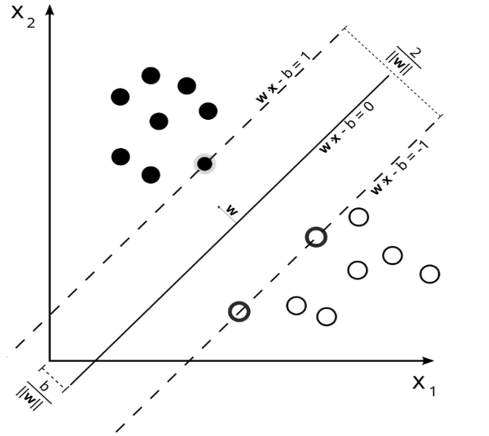

# SVM
SVM 的目标是找到一个超平面使各类样本点到该平面的距离最远：

有以下概念：
- 超平面(图中实线)可以描述为：$w^Tx+b=0$，其中$w$和$b$为参数.
- 空间中的点$x$到超平面的距离$d=\frac{|w^Tx+b|}{||w||}$.
- 支持向量(图中虚线上的点)：样本点中距离超平面最近的点叫做支持向量.
- 样本点可以描述为$x$、$y$，其中$x$为向量，$y$为类别($y=-1$ 或 $1$，表示在超平面的不同侧).

假设支持向量到超平面的距离为$d$，那么有：
$$ \left\{
\begin{aligned}
\frac{w^Tx+b}{||w||}&\ge d,y=1 \\
\frac{w^Tx+b}{||w||}&\le -d,y=-1\\
\end{aligned}
\right.\\
\\
\\
\Rightarrow 
\left\{
\begin{aligned}
\frac{w^Tx+b}{||w||d}&\ge 1,y=1 \\
\frac{w^Tx+b}{||w||d}&\le -1,y=-1\\
\end{aligned}
\right. \\

$$

我们令$||w||d=1$得到:

$$

(w^Tx+b)y \ge1

$$

特别地，当$x$是支持向量时：

$$

(w^Tx+b)y =1

$$

那么支持向量$x$到超平面的距离：

$$

d=\frac{|w^Tx+b|}{||w||}=\frac{(w^Tx+b)y}{||w||}=\frac{1}{||w||}

$$

我们的目标就是最大化支持向量到超平面的距离$d$,即在$(w^Tx_i+b)y_i \ge1$的条件下最小化$\frac{1}{2}||w||^2$

