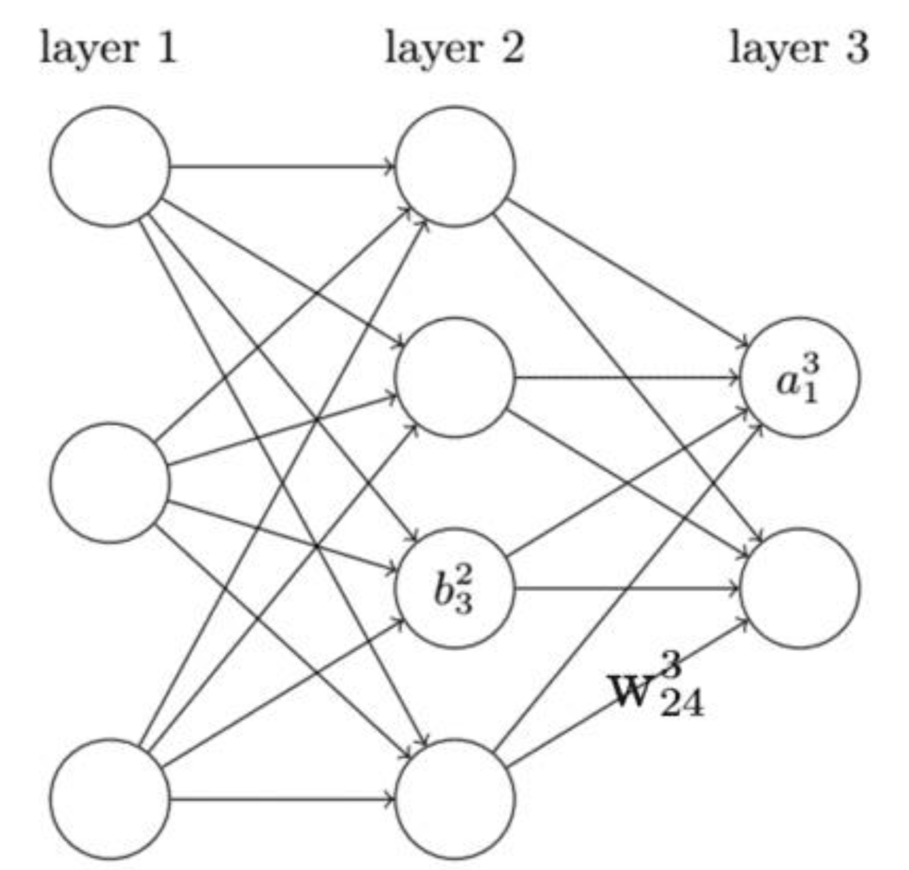

# Back Propagation

## Neurons

For each neuron, it can be considered as:
- **input weights**: $w_{jk}^l$ , the weight of $kth$ neuron( $l-1$ layer) to $jth$ neuron( $l$ layer )
- **bias**: $b_j^l$ , the bias of $jth$ neuron( $l$ layer)
- **activate function**: $\sigma(x)$ , do same operation to each element in $x$ 
- **activated output**: $a_j^l$

So we have the formula below the connect each layer:

$$a_j^l=\sigma(\sum_k w_{jk}^la_k^{l-1}+b_j^l)$$

Reformulate in matrix type:

$$a^l=\sigma(w^la^{l-1}+b^l)$$

Given the definition:
- $z^l=w^la^{l-1}+b^l$
- $\delta_j^l=\frac{\partial C}{\partial z_j^l}$ , the error of the $jth$ neuron in $l$ layer.
- Hadamard product: $A\odot B$ , multiply each corresponding element, A and B are the same size.

## Back Propagation
- Output layer error: $\delta_j^L=\frac{\partial C}{\partial z_j^L}=\frac{\partial C}{\partial a_j^L}\frac{\partial a_j^L}{\partial z_j^L}=\frac{\partial C}{\partial a_j^L}\sigma '(z_j^L)$
  
  In matrix form: $\delta^L=\nabla _aC\odot \sigma'(z^L)$