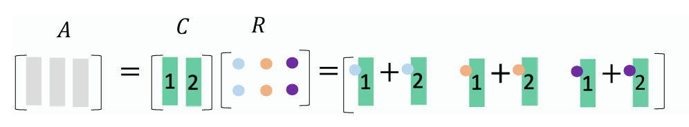
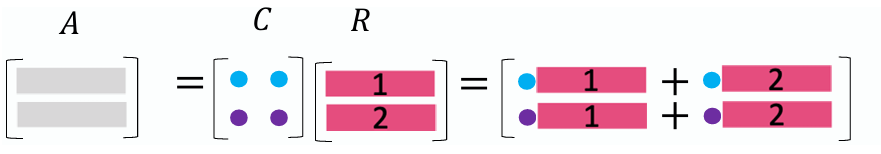

# Five Factorizations
- $A=CR$, Columns in C are the independent columns in A,R is reduced echelon form of A.

- $A=LU$, $L$ is lower triangular and $U$ is upper triangular.
- $A=QR$, $Q$ is orthogonal matrix and $R$ is upper triangular matrix.
- $S=Q\Lambda Q^T$, $S$ is symmetric matrix, columns of $Q$ is the orthogonal eigenvectors of $S$, elements of diagonal matrix $\Lambda$ is the corresponding eigenvalues.
- $A=U\Sigma V^T$, $U$ and $V$ is orthogonal matrix,  $\Sigma$ is diagonal matrix.

## $A=CR$

 $C$ consists of independent columns of A, columns of R can rebuild the matrix $C$ as shown above. Below is another version:
 

## $A=LU$

## $A=QR$

## $S=Q\Lambda Q^T$

## $A=U\Sigma V^T$
**Refernces**

[The Art of Linear Algebra](https://github.com/kenjihiranabe/The-Art-of-Linear-Algebra)

