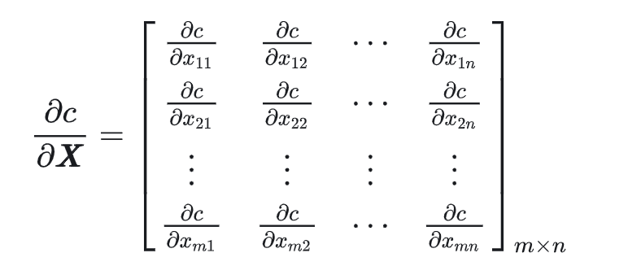

One variable gradient decent:

$$x_{new}=x_{old}-\alpha \nabla_xf(x_{old})$$  
($\alpha$ is the learning rate)

And it's the same with the above when $x$ is a column vector, but the $\nabla_xf(x)$ becomes like $[\frac{\partial f}{\partial x_1},\frac{\partial f}{\partial x_2},... ,\frac{\partial f}{\partial x_n}]^T$.

With gradient decent we can find the $x$ that minimize $f(x)$. 

Example of muti-varible linear regression:

