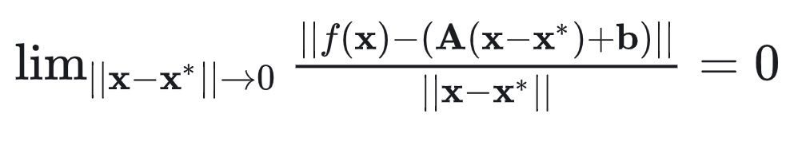
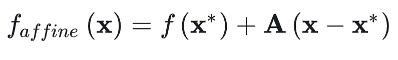

# Derivation of Multivariate Functions
We have a function:

$$\textbf{y}=f\left(\textbf{x}\right) \quad \textbf{x} \in R^{n}, \ \textbf{y} \in R^{m}$$

When existing a affine function that could fit $f$ well around $x$ , we mean that $f$ is derivable at $x$

## Affine Function
If $f:R^{n}\rightarrow R^{m}$ satisfies:

$$f\left(\alpha\textbf{x}+\beta\textbf{y}\right)=\alpha f\left(\textbf{x}\right)+\beta f\left(\textbf{y}\right)$$

$\alpha$ and $\beta$ are scalars, then we can find a matrix $\textbf{A}_{m\times n}$ , $f$ can be represented as:

$$\forall \textbf{x} \in R^n : f\left(\textbf{x}\right)=\textbf{A}\textbf{x}$$

Proof:

$\textbf{x}$ can be represented as:

$$\textbf{x}=x_1e_1+x_2e_2+...+x_ne_n$$

$e_i$ is a column vector ,the $ith$
 element is $1$ and the remaining elements are $0$ 

 So we have:

 $$f(\textbf{x})=f(x_1e_1+x_2e_2+...+x_ne_n)=\sum_{i=1}^nx_if(e_i)$$

 Transform the result to matrix :

 $$f(\textbf{x})=\sum_{i=1}^nx_if(e_i)=[f(e_1),f(e_2),...,f(e_n)]\textbf{x}=A\textbf{x}$$

Add a scalar $b$ to $A\textbf{x}$ then we get a affine function:

$$f(\textbf{x})=A\textbf{x}+b$$

## Derivation

If $f$ is derivable at $\textbf{x}^*$ , we have:

To meet the limitation , $b=f(\textbf{x}^*)$ , so the affine function :

Select a coordinate axis $i$ ,then the limitation at this coordinate:

$$\lim _ { \alpha \rightarrow 0 } \left| \left| \frac { f ( x ^ { * } + \alpha e _ { i } ) - f ( x ^ { * } ) } { \alpha } - A e _ { i } \right| \right|$$

We can easily find that the $ith$ colomn of $A$

