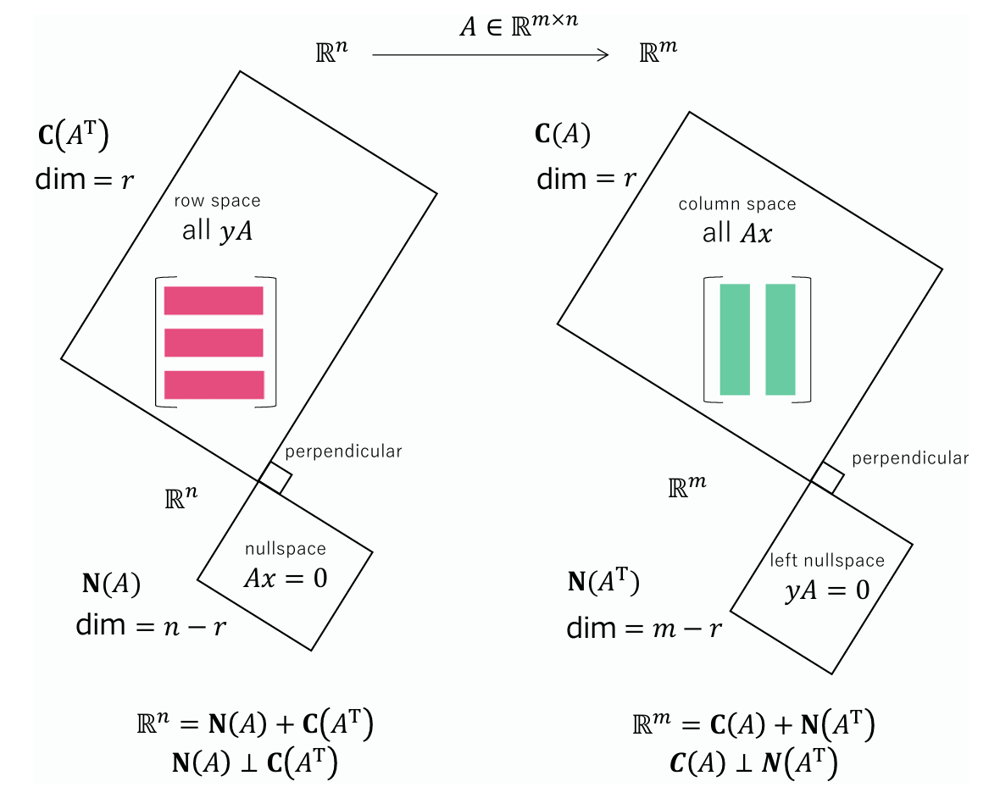

# Other Formulas
## $QQ^T=I$
Columns of $Q$ are unit orthogonal vectors like: 

$$Q=\begin{bmatrix}q_1&q_2&...&q_n\end{bmatrix}$$

$q_i^Tq_j=1$ if $i=j$, else $q_i^Tq_j=0$. Then we have: $Q^T=Q^{-1}$.

**Proof:**

$$Q^T=\begin{bmatrix}q_1^T \\
q_2^T\\
...\\
q_n^T\end{bmatrix}$$

Then: 

$$Q^TQ=\begin{bmatrix}q_1^T \\
q_2^T \\
 ... \\ 
 q_n^T\end{bmatrix}\cdot\begin{bmatrix}q_1&q_2&...&q_n\end{bmatrix}=\begin{bmatrix}
q_1 \cdot q_1 & q_1 \cdot q_2 & \cdots & q_1 \cdot q_n \\
q_2 \cdot q_1 & q_2 \cdot q_2 & \cdots & q_2 \cdot q_n \\
\vdots & \vdots & \ddots & \vdots \\
q_n \cdot q_1 & q_n \cdot q_2 & \cdots & q_n \cdot q_n
\end{bmatrix}=I$$

## $A(A^TA)^{-1}A^T$

Projection matrix: $P=A(A^TA)^{-1}A^T$

Left multiply $x$ by $P$ so that we project $b$ to the column space of $A$: $Pb$

Especially when $A$ is a vector $a$ we have $P=\frac{aa^T}{a^Ta}$, then $Pb=\frac{aa^T}{a^Ta}b=\frac{a(a^Tb)}{a^Ta}=\frac{a^Tb}{a^Ta}a$.

**Proof:**

$Ax$ is a vector in the column space of $A$, denoted as $C(A)$ then we must have $Ax-b$ that is perpendicular to the $C(A)$, so $Ax-b$ is in $N(A^T)$:

$$\begin{align}
A^T(Ax-b)&=0\\
\Rightarrow x&=(A^TA)^{-1}A^Tb 
\end{align}
$$

Then $Ax=A(A^TA)^{-1}A^Tb$ is the projection vector of $b$, so we denote $P=A(A^TA)^{-1}A^T$ as the projection matrix.

Four Subspaces:

