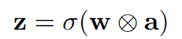
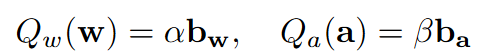
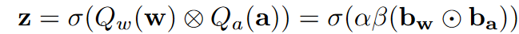
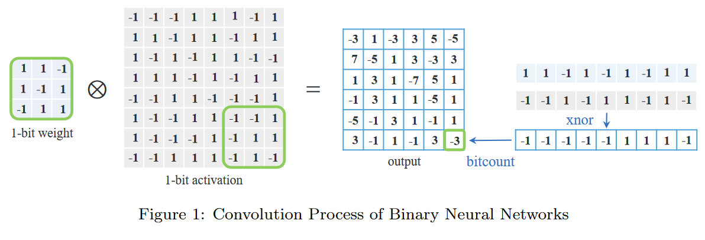

# Binary Neural Networks
In full-precision convolutional neural networks, the basic operation can be expressed as:

- w and a represent the weight tensor and activation tensor generated by the previous network layer
- σ(·) : non-linear function 
- z: output tensor 
- ⊗: convolution operation.

## Forward Propagation

Goal of network binarization: represent the floating-point weights w and/or activations a using 1-bit.

Binarization function:

- $b_w$ and $b_a$ are the tensor of binary weights (kernel) and binary activations.
- Sign function is used for $Q_w()$ and $Q_a()$

So that the forward propagation can be reformulated:

⊙ denotes the inner product for vectors, with bitwise operation XNOR-Bitcount, showing as follows:

## Back Propagation
- BP is based on the **gradient descent** to update the parameters.

- Usually the binarization function is **not differentiable**, and even worse, the derivative value in part of the function vanishes.

- So common gradient descent cannot be directly applied to update the binary weights.

**Straight-through estimator (STE)** is to address that problem.

The function of STE is defined as: 

 $$clip(x, −1, 1) = max(−1, min(1, x))$$ 

