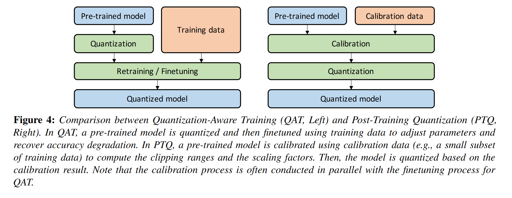

# Quantization
## Introduction
Achieving efficient, real-time NNs with optimal accuracy requires rethinking the design, training, and deployment of NN models:
- Designing efficient NN model architectures
- Co-designing NN architecture and hardware together
- Pruning: neurons with small saliency (sensitivity) are removed (minimally affects the model output/loss function), resulting in a sparse computational graph. 
- Knowledge distillation: training a large model and then using it as a teacher to train a more compact model
- Quantization

## Basic Concepts of Quantization
### Problem Setup
Assume a NN has L layers with learnable parameters $W1, W2, ..., WL$ , with $θ$ denoting the combination of all such parameters. Optimize the function:

$$L(θ) = \frac{1}{N}\sum_{i=1}^N l(xi, yi; θ)$$

- $x_i,y_i$ : input data and label
- $l()$ : loss function
- $N$ : total data points

Denote:
-   $h_i$ : input hidden activations of the ith layer 
- $a_i$ : corresponding output hidden activation

Assume that $\theta$ is stored in floating point precision

Quantization goal:

Reduce the precision of both the **parameters (θ)**, as well as the **intermediate activation maps** (i.e., hi, ai) to low-precision, with minimal impact on the **generalization power/accuracy of the model**.

### Uniform Quantization
Define a function that can quantize NN weights and activations to a finite set of values.

$$Q(r) = Int(r/S) − Z$$

- $r$ : real valued input (activation or weight)
- $S$ : real valued scaling factor
- $Z$ : an integer zero point
- $Int$ : maps a real value to an integer value

Dequantization: $\hat{r} = S(Q(r) + Z).$

### Symmetric and Asymmetric Quantization

Choice of the scaling factor $S$

$S = \frac{β−α }{2^b − 1}$

- $[α, β]$ : the clipping range.
- $b$ : quantization bit width.

Two types of quantization:
- Symmetric: $α = −β.$ , $−α = β = max(|r_{max}|, |r_{min}|).$ 
  
  Symmetric quantization is widely adopted because zeroing out the **zero point can lead to reduction in computational cost during inference**
- Asymmetric: i.e., $α = r_{min},  β = r_{max}$.

Using min/max approach is susceptible to outlier data in the activations.

Approaches to address this:
- Use **percentile**: the $i$-th largest/smallest values are used as $β/α$.
- Select $α$ and $β$ to minimize KL divergence (i.e., information loss) between the real values and the quantized values .

### Range Calibration Algorithms: Static vs Dynamic Quantization

Another important differentiator of quantization methods is **when the clipping range is determined**：
- **Dynamic quantization**: range is dynamically calculated for each activation map during runtime.
- **Static quantization**: clipping range is pre-calculated and static during inference.

### Quantization Granularity

- Layerwise Quantization: 
- Groupwise Quantization:
- Channelwise Quantization:
- Sub-channelwise quantization: 

### Non-Uniform Quantization

**Quantization steps** as well as **quantization levels** are allowed to be non-uniformly spaced: 

$$Q(r) = X_i, if \space r ∈ [∆_i, ∆_{i+1})$$

- $X_i$ : discrete quantization levels 
- $∆_i$ : quantization steps

Some examples:

- Use a logarithmic distribution
- Binarycode-based quantization: a real-number vector $r ∈ R^n$ is quantized into $m$ binary vectors by representing $r ≈ ∑_{i=1}^m α_ib_i$ , with the scaling factors $α_i ∈ R$ and the binary vectors $b_i ∈ \{−1, +1\}^n$ .

To further improve, some formulate non-uniform quantization as an optimization problem:

$$\mathop{min}\limits_Q ‖Q(r) − r‖^2$$

So the quantizer itself can also be jointly trained with the model parameters.(learnable quantizers).

**Restrictions**: Non-uniform quantization schemes are typically difficult to deploy efficiently on general computation hardware, e.g., GPU and CPU.

### Fine-tuning Methods

It is often necessary to adjust the parameters in the NN after quantization. It can be performed by two way below:

- Retraining the model: QuantizationAware Training (QAT)
  
  - Quantization may introduce a perturbation to the trained model parameters, and this can push the model away from the point to which it had converged when it was trained with floating point precision. 
  
  - It is possible to address this by re-training the NN model with quantized parameters so that the model can converge to a point with better loss.

  - QAT: the usual forward and backward pass are performed on the quantized model in floating point, but the model parameters are quantized after each gradient update.
  - How the the non-differentiable quantization operator is treated: using Straight Through Estimator (STE).
  - Disadvantage: the computational cost of re-training the NN model.
  
- Without re-training: Post-Training Quantization (PTQ).
  -  For low-precision quantization, with a lower cost compared to QAT.
  - Multiple approaches have been proposed to mitigate the accuracy degradation

- Zero-shot Quantization: To achieve minimal accuracy degradation after quantization, we need access to the entire of a fraction of training data. Access to the original training data is not possible during the quantization procedure. Several methods are prospered to address the problem.

### Stochastic Quantization

The high level intuition has been that the stochastic quantization may allow a NN to explore more as  **small weight updates may not lead to any weight change, as the rounding operation may always return the same weights**. 

However, enabling a **stochastic rounding** may provide the NN an opportunity to escape, thereby updating its parameters.

In short, **stochastic quantization maps the floating number up or down with a probability associated to the magnitude of the weight update.**

## Mostly Used: Quantization Below 8 Bits
### Simulated and Integer-only Quantization
- Simulated quantization: the quantized model parameters are stored in low-precision, but the operations(eg: convolution) are carried out with floating point arithmetic.
- Integer-only quantization: all the operations are performed using low-precision integer arithmetic.
  

### Mixed-Precision Quantization
In mixed-precision, each layer is quantized with different bit precision as following shows :

The challenge for this is selecting this mixed-precision for each layer. And some works are done to address the problem:
- Propose a reinforcement learning (RL) based method to determine automatically the quantization policy.
- Formulate the mixed-precision configuration searching problem as a Neural Architecture Search (NAS) problem and used the Differentiable NAS (DNAS) method to efficiently explore the search space. **The two approaches above require large computational resources**

###  Hardware Aware Quantization
Use hardware to accelerate reference speed.

### Distillation-Assisted Quantization
Model distillation is a method in which a large model with higher accuracy is used as a teacher to help the training of a compact student model.

During the training of the student model, instead of using just the ground-truth class labels, model distillation proposes to leverage the soft probabilities produced by the teacher, which may contain more information of the input.

Overall loss function incorporates both the student loss and the distillation loss:

$$L = αH(y, σ(z_s)) + βH(σ(z_t, T ), σ(z_s, T ))$$

- $α$ and $β$ are weighting coefficients to tune the amount of loss from the student model and the distillation loss
- $y$ is the ground-truth class label
- $H$ is the crossentropy loss function
- $z_s/z_t$ are logits generated by the student/teacher model
- $σ$ is the softmax function
- $T$ is its temperature defined as: $p_i=\frac{e^{z_i/T}}{\sum_j e^{z_j/T}}$

### Extreme Quantization
Binarization quantize the values to a 1-bit representation.

But binarization will also lead to a large amount of accuraccy degradation.

### Vector Quantization

## Quantization And Hardware Processors
