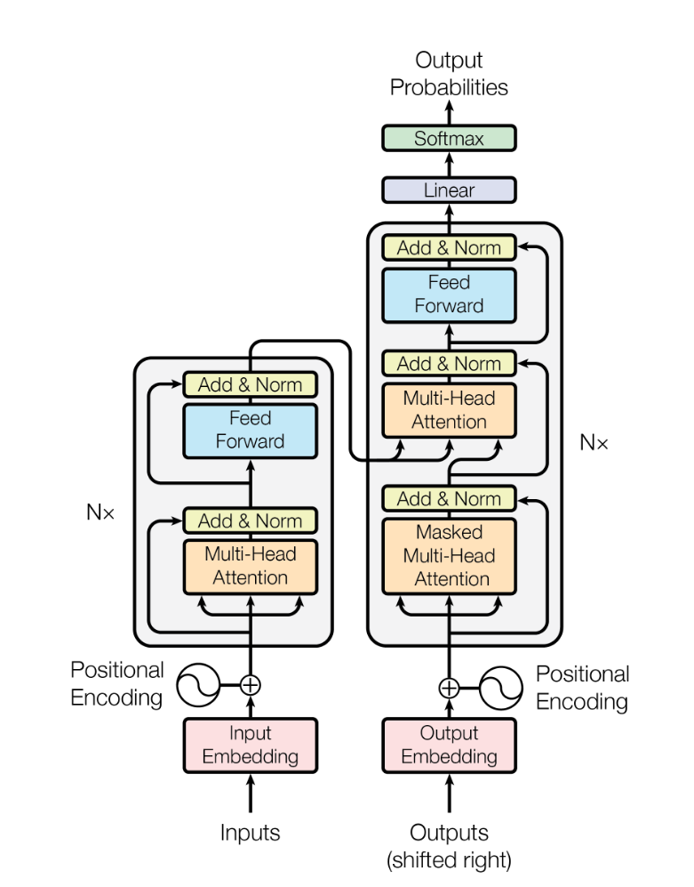

Embedded matrices:

$$X = \begin{bmatrix}
x_1 \\
x_2 \\
\vdots \\
x_n
\end{bmatrix}$$

Each $x$ represents a embedded row vector(a word), the length of $x$ is $m$. So the size of $X$ is $n \times m$ .

Calculate K,Q,V matrices:

$$
Q = X W_Q, \quad K = X W_K, \quad V = X W_V
$$

### 1. Input to the Encoder

Let the input to the encoder be a matrix $X$ of shape $(n, d_{\text{model}})$ , where:
- $n$ is the number of tokens.
- $d_{\text{model}}$ is the dimensionality of the embedding space.

Each row of $X$ is a token's embedded representation.

### 2. Multi-Head Self-Attention (MHA)

#### Steps in Multi-Head Attention:
1. **Linear Projections of Input**: The input matrix $X$ is linearly projected into three different matrices: **queries (Q)**, **keys (K)**, and **values (V)** using learned weight matrices $W_Q$, $W_K$, and $W_V$:
   
   $$
   Q = X W_Q, \quad K = X W_K, \quad V = X W_V
   $$

   Where $W_Q, W_K, W_V \in \mathbb{R}^{d_{\text{model}} \times d_k}$ .

2. **Scaled Dot-Product Attention**: For each query $Q$, we compute the attention scores based on the dot product between $Q$ and $K$. These scores are scaled by $\frac{1}{\sqrt{d_k}}$ (the dimension of the query/key vectors) to prevent large values that can destabilize learning.
   
   $$
   \text{Attention Scores} = \frac{QK^T}{\sqrt{d_k}}
   $$
   
3. **Softmax**: The attention scores are passed through a softmax function to generate a probability distribution (attention weights).
   
   $$
   \text{Attention Weights} = \text{softmax}\left(\frac{QK^T}{\sqrt{d_k}}\right)
   $$
   
4. **Weighted Sum of Values**: The attention weights are used to compute a weighted sum of the values $V$ to obtain the output of the attention mechanism.
   
   $$
   \text{Attention Output} = \text{Attention Weights} \cdot V
   $$

5. **Multi-Head Attention**: Instead of computing a single set of attention outputs, we compute $h$ attention heads in parallel, each with different learned projection matrices. The results are concatenated and linearly projected back into the output space:
   
   $$
   \text{Multi-Head Output} = \text{Concat}( \text{Head}_1, \text{Head}_2, \dots, \text{Head}_h ) W_O
   $$

   Where each **Head** is calculated as the attention output described above, and $W_O$ is a learned weight matrix of shape $(hd_k, d_{\text{model}})$ .

### 3. Add & Normalize (Residual Connection + Layer Normalization)

After the multi-head attention output is computed, the next step is to apply the **residual connection** followed by **layer normalization**.

1. **Residual Connection**: The original input $ X $ is added to the multi-head attention output:
   
   $$
   \text{Attention Output with Residual} = \text{Multi-Head Output} + X
   $$
   
2. **Layer Normalization**: After the residual addition, layer normalization is applied:
   
   $$
   \text{LayerNorm}_1\left(\text{Multi-Head Output} + X\right) = \frac{\text{Multi-Head Output} + X - \mu}{\sigma} \cdot \gamma + \beta
   $$

   Where $\mu$ and $\sigma$ are the mean and standard deviation of the summed input, and $\gamma$, $\beta$ are learned parameters for scaling and shifting.

### 4. Feed-Forward Neural Network (FFN)

After the multi-head attention and layer normalization, the next step is to pass the output through a feed-forward neural network, which consists of two linear transformations with a ReLU activation in between:

1. **First Linear Transformation**: 
   
   $$
   \text{FFN}_1 = \text{max}(0, X W_1 + b_1)
   $$

   Where $W_1 \in \mathbb{R}^{d_{\text{model}} \times d_{\text{ff}}}$ and $b_1 \in \mathbb{R}^{d_{\text{ff}}}$ , with $d_{\text{ff}}$ being the dimensionality of the hidden layer in the FFN.

2. **Second Linear Transformation**: 
   
   $$
   \text{FFN}_2 = \text{FFN}_1 W_2 + b_2
   $$

   Where $W_2 \in \mathbb{R}^{d_{\text{ff}} \times d_{\text{model}}}$ and $b_2 \in \mathbb{R}^{d_{\text{model}}}$ .

### 5. Add & Normalize (Residual + Layer Normalization)

After the feed-forward network, the process is similar to the multi-head attention step:

1. **Residual Connection**: Add the input to the FFN output:
   
   $$
   \text{FFN Output with Residual} = \text{FFN}_2 + \text{LayerNorm}_1\left(\text{Multi-Head Output} + X\right)
   $$

2. **Layer Normalization**: Finally, apply layer normalization again:
   
   $$
   \text{LayerNorm}_2\left(\text{FFN Output with Residual}\right) = \frac{\text{FFN Output with Residual} - \mu}{\sigma} \cdot \gamma + \beta
   $$

